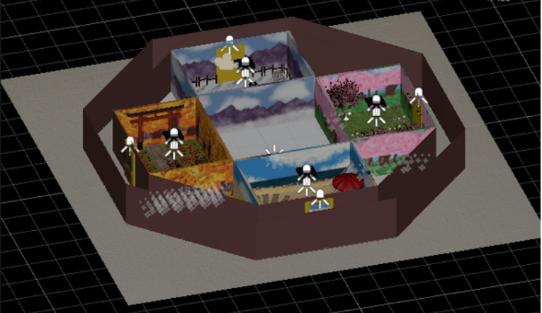
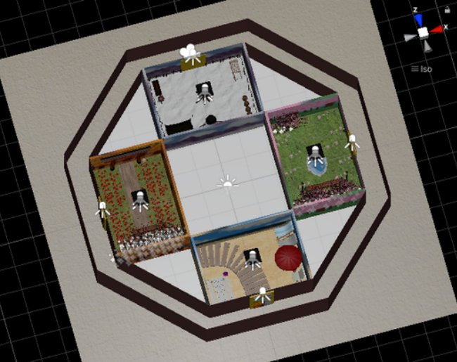

# Octangle

    A Redirected Walking Experience.

# Table of Contents

- [Octangle](#octangle)
- [Table of Contents](#table-of-contents)
- [Development Information](#development-information)
  - [Repository](#repository)
- [About](#about)
  - [What is the Octangle?](#what-is-the-octangle)
  - [What is a Redirected Walking Experience?](#what-is-a-redirected-walking-experience)
  - [What are Virtual Reality Locomotion Techniques?](#what-are-virtual-reality-locomotion-techniques)
    - [Terminology](#terminology)
      - [Reposition](#reposition)
      - [Reorientation](#reorientation)
      - [Overt](#overt)
      - [Subtle](#subtle)
      - [Continuous](#continuous)
      - [Discrete](#discrete)
    - [Four types of Reposition](#four-types-of-reposition)
    - [Four types of Reorientation](#four-types-of-reorientation)
    - [References](#references)
  - [Goal](#goal)
  - [Infographic](#infographic)
- [Prerequisites](#prerequisites)
  - [List of Prerequisites](#list-of-prerequisites)
- [Set-Up \& Use](#set-up--use)
  - [Method 1: Run Build File](#method-1-run-build-file)
  - [Method 2: Fork and Clone Repository for Unity Game Development](#method-2-fork-and-clone-repository-for-unity-game-development)
    - [Download Unity](#download-unity)
    - [Download Oculus Link](#download-oculus-link)
      - [Link Cable](#link-cable)
      - [Air Link](#air-link)
    - [Actually Running the Project](#actually-running-the-project)
  - [Live Cast](#live-cast)
- [Brief Explanation of Project Files](#brief-explanation-of-project-files)
  - [Scripts](#scripts)
    - [FollowHead](#followhead)
    - [PhysicalCompass](#physicalcompass)
    - [Redirection](#redirection)
    - [Virtual Compass](#virtual-compass)
    - [Register Collisions](#register-collisions)
  - [Hierarchy](#hierarchy)
  - [Altering Script Parameters within Unity GUI](#altering-script-parameters-within-unity-gui)
    - [CenterEyeAnchor Object](#centereyeanchor-object)
    - [Turn Time Toggle](#turn-time-toggle)
    - [Rotation Parameter](#rotation-parameter)
    - [Rotation Gain when Active Parameter](#rotation-gain-when-active-parameter)
    - [Translation Gain Parameter](#translation-gain-parameter)
- [PostScript](#postscript)

# Development Information

This experience was developed for our Senior Human-Computer Interaction Capstone in the Unity Game Engine (v. 2020.3.37f1) using the Oculus Quest 2 by:

  - Macey Cohn
  - Emaan Rana
  - Delaney Reed

Under the direction and guidance of:

  - [Jerald Thomas](https://www.jeraldthomas.com/)
  - [Doug Bowman](https://wordpress.cs.vt.edu/3digroup/author/dbowman/)

## Repository

The repository containing the files can be found at the linked [Octangle GitHub Repository](https://github.com/HCI-Capstone/octangle-supported).

# About

    

## What is the Octangle?

The Octangle is a octagonal hallway with four equidistant doors that lead to four distinct rooms depicting one of four seasons each. The entrances are depicted as abstract paintings of the respective season which were generated by `DALL-E 2`. These paintings can be walked through for a seamless and free experience.

## What is a Redirected Walking Experience?

- Redirected Walking is is a Virtual Reality Locomotion Technique that enables users to explore a virtual space that _feels_ larger than the physical space by applying manipulations to the Virtual Environment without the user noticing it.

## What are Virtual Reality Locomotion Techniques?

Virtual Reality Locomotion Techniques aim to apply some sort of manipulation to the either the movements of the user or to the environment in order to enhance a VR Experience without the user knowing about the employment of these techniques, that is, we do not want to break immersion and in fact would like the user to be as oblivious as possible.

### Terminology

#### Reposition

- Manipulate correspondence between reality and virtual reality. Compress large Virtual Reality into smaller Reality.

#### Reorientation

- Reorient the user away from collision (walls).

#### Overt

- Easily noticed by user.

#### Subtle

- Not easily noticed by user.

#### Continuous

- Applied over time.

#### Discrete

- Applied instantaneously.

### Four types of Reposition

1. Overt Continuous Reposition
   - Translation about user position, normally disorienting, can be mitigated by contextualizing.
2. Subtle Continuous Reposition
   - Travel distances can be downscaled by 14% or upscaled by 26% without being noticeable.
3. Overt Discrete Reposition
   - Teleportation, disorientation can be mitigated through use of a portal (contextualizing).
4. Subtle Discrete Reposition
   - Stimulus in the peripherals can mask abrupt translations in the environment.

### Four types of Reorientation

1. Overt Continuous Reorientation
   - Intervention when user approaches boundaries of physical space.
   - The turn around is applied rotational gain.
   - Example: 180° physical turn → 360° virtual turn.
   - Visual distractors to avoid breaking presence.
2. Subtle Continuous Reorientation
   - Users can be physically turned 49° more or 20° less in VR without noticing.
3. Overt Discrete Reorientation
   - “Freeze-and-turn” resetting.
4. Subtle Discrete Reorientation
   - Change blindness allows the location of doors and other objects to move for convenience.

### References

- [[1]](./Papers/A%20Taxonomy%20for%20Deploying%20Redirection.pdf) A Taxonomy for Deploying Redirection Techniques in Immersive Virtual Environments
- [[2]](./Papers/Estimation%20of%20Detection%20Thresholds.pdf) Estimation of Detection Thresholds for Redirected Walking Techniques
- [[3]](./Papers/Estimation%20of%20Rotation%20Gain%20Thresholds%20Considering%20FOV%2C%20Gender%2C%20and%20Distractors.pdf) Estimation of Rotation Gain Thresholds Considering FOV, Gender, and Distractors

## Goal

The goal of the experience is to demonstrate how manipulating the one to one mapping of real life movements to virtual reality movements can assist in a more accessible experience for users restricted to utilizing smaller spaces for virtual reality experiences. The Octangle in particular utilizes both Translation Gain where virtual speed is faster than real life speed as well as Rotation Attenuation where virtual rotation is shorter than the actual real world rotation made by the user.

## Infographic

For more information on the Octangle, check out this great [Infographic](https://github.com/HCI-Capstone/octangle-supported/tree/main/Files/Infographic.pdf) Delaney made.

    

# Prerequisites

The Octangle model in the demo found in the repository was made such that the experience is best suited for a 4 meter by 4 meter square space where the entire space is designated for movement when donning the headset.

The intention is that the user begins the experience along any of the edges of the square perimeter so long as they start in the middle of it with their back as close as possible to the guardian or boundary such that the user is facing the inside of the designated square space.

## List of Prerequisites

- Oculus Quest 2
- Access to 4m x 4m space
- Computer with dedicated Graphics Card
  - Strongly Recommended if intending to Develop with Unity Game Engine
- Link Cable
  - Long enough to walk around 4m x 4m space
  - Not needed if using Air Link instead

# Set-Up & Use

There are two ways to experience and utilize the Octangle.

## Method 1: Run Build File

Pull the build file off of the repository and load it into your Oculus Quest 2 for use. Need Macey to expand on how this works lmao, mention live share functionality. Right now this method is unpreferred due to latency issues and the capabilities of the Oculus Quest 2 being unable to properly support the project we have produced, therefore, we suggest Method 2 when applicable.

## Method 2: Fork and Clone Repository for Unity Game Development

Alternatively, if desired, the repository can be forked and cloned from GitHub for personal use, testing, and exploration.
   - To expand, I will explain how to set up the Oculus Quest 2 for further development on the Octangle. Then I will explain some of the scripts that can be found in the repository.

In order to experiment with translation and rotation first hand, we first need to set up the development environment which I will explain now.

### Download Unity

1. Download Unity Game Engine Hub (may be called `Unity Hub`).
   - This is Unity's version and Project Manager essentially.
   - Prompts user to select a version with which they wish to open some Unity Project.
2. Within the `Unity Hub`, download the `2022.3.37f1` version of Unity.
   - Note that this is important since some Unity versions may not support our project well.
3. Once the version is downloaded, click `Open` in `Unity Hub` and navigate to the location on your local machine where you cloned the forked Octangle repository.
4. If you do not see a hallway with a painting, hover over `File` in the top left corner and select the `Open Scene` option and select `SampleScene`. You should now see the Octangle Hallway.
5. Make sure to navigate to `File` in the top left corner and click `Build Settings` to ensure that the Build Settings are set to `Android`.

### Download Oculus Link

Now we need to Set-Up the Oculus Quest 2 in order to actually run the project in real time.
> Note that running the project in real time will only work on a computer with a dedicated graphics card. If you do not have a dedicated graphics card, you will need to build the project and load it onto your Oculus Quest 2 everytime you want to this it. This can be very tedious but is a possible option.

1. Navigate to the [Download Page](https://www.meta.com/quest/setup/) which I've linked for convenience.
2. Scroll and select `Download Software` under the Oculus Quest 2 section of the page.
3. Create a `Meta Account` if you don't already have one.
4. Once the download is complete, open the `Oculus Link` software which is called `Oculus`.
5. Navigate to `Devices` in the left graphical user interface sidebar and select `Add Device`.
6. It will ask you to connect using either a `Link Cable` or `Air Link`.
   - We personally found Air Link to be very convenient, however, if you experience a lot of lag for any reason it may be beneficial to swap over to a Link Cable, preferably a long one since you can't do much testing with a short one.

#### Link Cable

Set up is fairly straightforward with the Link Cable. You select Link Cable in the Oculus app and once the connected has been established and confirmed, see that this has loaded/registered correctly on the Oculus itself and try hitting play in Unity. You should be able to explore the demo.

#### Air Link

1. Have the Oculus desktop app downloaded.
2. Log into your account.
3. Make sure your headset is on and connected to the same wifi network as your computer.
4. Open the quick settings menu on your headset by pressing the leftmost area of the menu in the headset.
   - Where your profile picture and wifi are located.
5. Click "Oculus Link" in the headset.
6. Once the pop up menu in the headset opens, toggle "air link" to be on.
7. If this is not an option, turn on air link capabilities under "experimental features".
8. our pc should show up on the list, so click it and select connect to pair.
9. Once the two devices are paired, you should be able to click launch from within the headset, and your connection will be active.

### Actually Running the Project

Now that both Unity and the Oculus Quest 2 are set up, when you press the small `Play` button on the top of the main `Scene` screen, you should be able to load into the Octangle. Developing with the Oculus Link on a machine with a dedicated graphics card enables you to run without having to build as well as granting the convenient ability to alter values during a any `Play`through of the project as well as move object in real time. Note that these changes are volatile (temporary) and will be reverted back to the state they were in before hitting `Play` so make sure to track any values you want to keep before pressing `Play` again to stop the experience.

## Live Cast

This is more useful in the case that your are using [Method 1](#method-1-run-build-file) or needed to Build the project, but you can use the [Live Cast](https://www.oculus.com/casting) feature to show anyone else what is happening for the user donning the headet.

# Brief Explanation of Project Files

An explanation of some project files and details that may help you get started and comfortable with the layout of the Project.

## Scripts

These are the Scripts that are currently being used to be aware of:

### FollowHead

- The script that causes the compasses to follow the head. This is applied to the "Compasses" empty game object and tracks the Center Eye Anchor.

### PhysicalCompass

- The script that allows the physical environment compass to rotate correctly. It is applied to "Green Arrow".

### Redirection

- The main script. This is where translational and rotational gain are applied, as well as where the button "B" is mapped to turn on and off the compasses. It is applied to Center Eye Anchor.

### Virtual Compass

- The script that allows the virtual environment compass to rotate correctly. It is applied to "Red Arrow".

### Register Collisions

- Registers when there is a collision in order to apply Redirection or not in certain regions, in this case, the corners of the Octangle are the only regions we apply redirection to.

## Hierarchy

Most of the Hierarchy in descriptively labeled. However, for those unfamiliar with develepment in the Quest 2, I wanted to make note of the `OVRPlayerController` Parent. This is the parent object whose children are where we applied some of our scripts. Namely, the Redirection Script is applied to the CenterEyeAchor if you are to click on the `OVRPlayerController` and continue to open the children until it appears.

## Altering Script Parameters within Unity GUI

### CenterEyeAnchor Object

In order to mess around with different values for both Translation and Rotation, click on the `CenterEyeAnchor` object in the Hierarchy and scroll until you see a component labeled "Redirection (Script)".

### Turn Time Toggle

Under this component there should be a checkbox that says `Turn Time`. When this is turned on, Redirection is applied. As of right now it turns on at the corners but can be forced on for the whole project during a `Play`through if so desired.

### Rotation Parameter

The `Rotation` is the usual, normal rotation when not at corners.

### Rotation Gain when Active Parameter

The `Rotation Gain when Active` is the Rotation manipulation being applied at corners. In our case, we are slowing down a 90 degree turn to appear less that 90 degrees so, we are "attenuating" the turn by passing a number less than `1` which is the default value (normal rotation).

### Translation Gain Parameter

The `Translation Gain` parameter is set up such that `1` is a default value where the user move at a normal/default speed, and `2` would be twice as fast, so on so forth.

# PostScript

Generally speaking, this Demo works well in a space slightly larger than a 4m x 4m space due to the rotation being set up in such a way that there is slight translation when turning. This is not a major issue but is still pending a elegant solution. For now, the Octangle serves as a proof of concept as well as evidence of our exploration into the topic of Locomotion Techniques within Virtual Reality.
